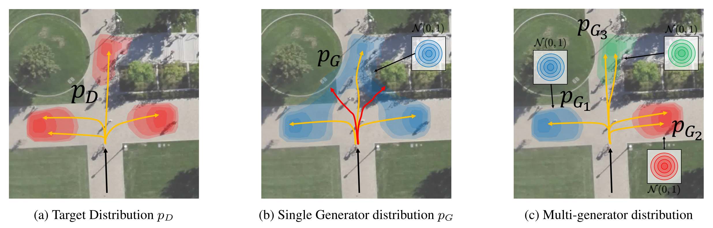
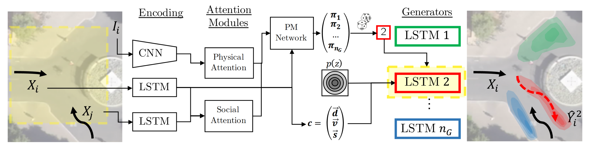

# MG-GAN: A Multi-Generator Model Preventing Out-of-Distribution Samples in Pedestrian Trajectory Prediction

This repository contains the code for the paper

> [MG-GAN: A Multi-Generator Model Preventing Out-of-Distribution Samples in Pedestrian Trajectory Prediction](https://arxiv.org/abs/2108.09274) \
Patrick Dendorfer*, Sven Elflein*, Laura Leal-Taixé (* equal contribution) \
International Conference on Computer Vision (ICCV), 2021


## Motivation

The distribution over future trajectories of pedestrians is often multi-modal and does not have connected support (a).

We found that single generator GANs introduce out-of-distribution (OOD) samples in this case due to GANs mapping the continuous latent variable *z* with a continuous function (b). 
These OOD samples might introduce unforseen behavior in real world applications, such as autonomous driving.

To resolve this problem, we propose to learn the target distribution in a piecewise manner using multiple generators, effectively preventing OOD samples (c).

<p align="center">
  
</p>


## Model 

Our model consists of four key components: *Encoding modules*, *Attention modules*, and our novel contribution **PM-Network** learning a distribution over multiple *Generators*.

<p align="center">
  
</p>

---

## Setup
First, setup Python environment 
```
conda create -f environment.yml -n mggan
conda activate mggan
```

Then, download the datasets (`data.zip`) from [here](https://github.com/selflein/MG-GAN/releases) and unzip in the root of this repository
```
unzip data.zip
``` 
which will create a folder `./data/datasets`.

## Training

Models can be trained using the script `mggan/model/train.py` using the following command

```bash
python mggan/models/pinet_multi_generator/train.py --name <name_of_experiment> --num_gens <number_of_generators>  --dataset <dataset_name> --epochs 50
```

This generates a output folder in `./logs/<name_of_experiment>` with Tensorboard logs and  the model checkpoints. You can use `tensorboard --logdir ./logs/<name_of_experiment>` to monitor the training process.

## Evaluation

For evaluation of metrics (*ADE*, *FDE*, *Precison*, *Recall*) for `k=1` to `k=20` predictions, use

```
python scripts/evaluate.py --model_path <path_to_model_directory>  --output_folder <folder_to_store_result_csv>
```

One can use `--eval-set <dataset_name>` to evaluate models on other test sets than the dataset the model was trained on. This is useful to evaluate the BIWI models on the Garden of Forking Paths dataset (`gofp`) for which we report results in the paper.


## Pre-trained models

We provide pre-trained models for *MG-GAN* with 2-8 generators together with the training configurations, on the BIWI datasets and Stanford Drone dataset (SDD) [here](https://github.com/selflein/MG-GAN/releases).

## Citation
If our work is useful to you, please consider citing

```bibtex
@inproceedings{dendorfer2021iccv,
  title={MG-GAN: A Multi-Generator Model Preventing Out-of-Distribution Samples in Pedestrian Trajectory Prediction}, 
  author={Dendorfer, Patrick and Elflein, Sven and Leal-Taixé, Laura},
  month={October}
  year={2021},
  booktitle={Proceedings of the IEEE/CVF International Conference on Computer Vision (ICCV)},
  }
```
